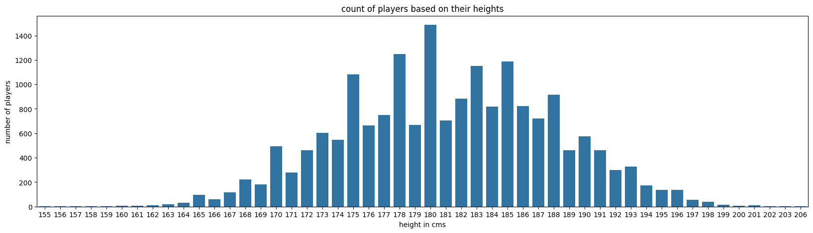
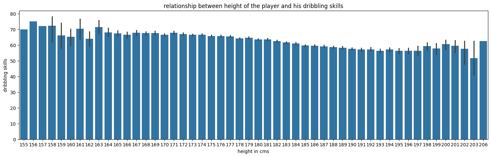
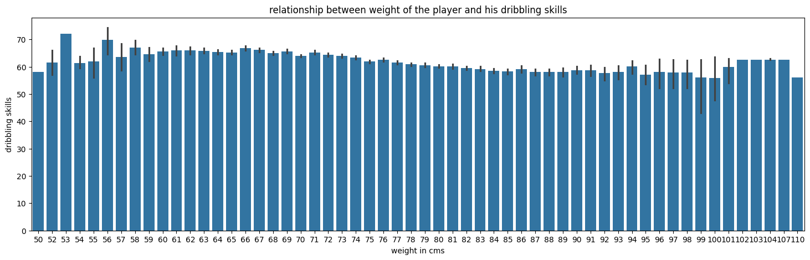
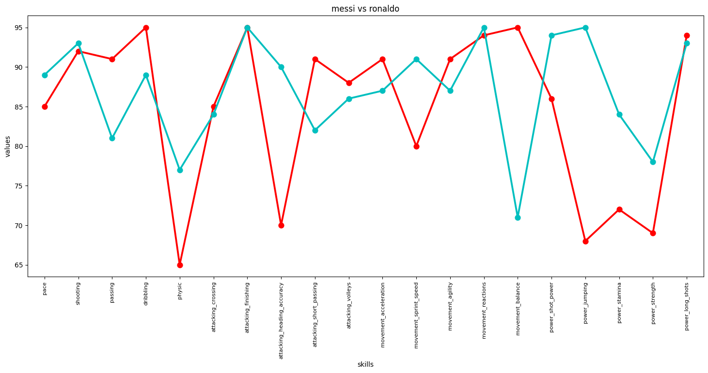
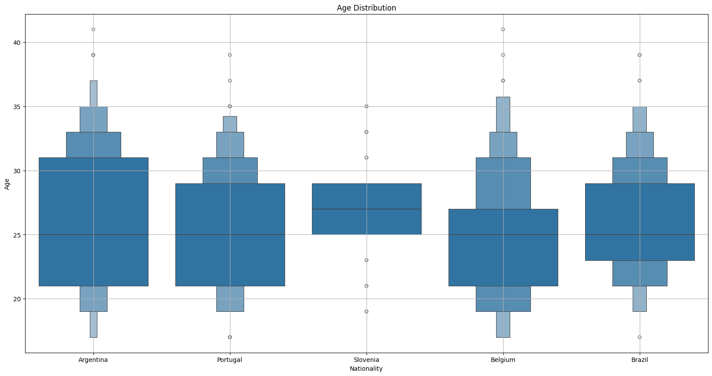
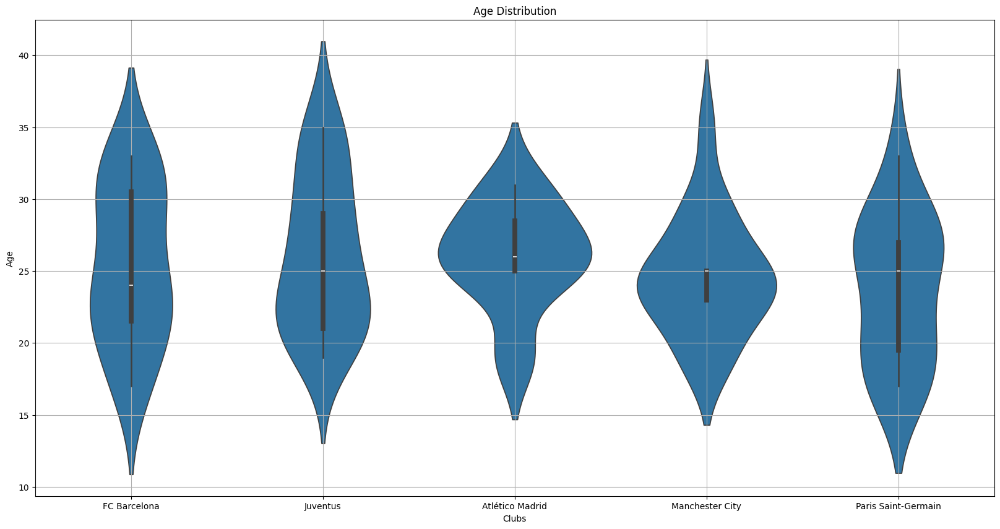

# FIFA 2021 in Numbers: EDA and Data Visualization

## Project Overview
The "FIFA 2021 in Numbers EDA and Data Visualization" project provides an analytical view into the vast data from the FIFA 2021 game, focusing on player attributes, team compositions, and market dynamics. This analysis aims to uncover patterns and insights that can help players and fans understand the factors that influence player performance and team success in FIFA 2021.

## Key Visualizations and Insights

### 1. Player Nationality Distribution
This bar chart visualizes the distribution of players across different nationalities, highlighting the global diversity in FIFA 2021.

### 2. Player Value vs Wage Correlation
The scatter plot shows the correlation between players' market values and their wages, illustrating the economic aspects of player management.

### 3. Player Attribute Distribution
Histograms showing the distribution of key attributes like pace, dribbling, and shooting among players.

### 4. Team Composition Analysis
This graph dives into the composition and quality of different teams, influencing gameplay and team selection strategies.

### 5. Trend in Player Attributes
A line graph displaying trends in player attributes across different ages to help in understanding player development.

### 6. Overall Rating Distribution
Histogram showcasing the overall ratings distribution across all players, aiding in player recruitment and game play strategy.

## Tools Used
- **Google Colab**: A cloud-based Python development environment with access to free GPUs.
- **Pandas**: For data manipulation and analysis.
- **Matplotlib and Seaborn**: For creating static data visualizations.
- **Plotly**: For interactive and dynamic charts.

## Conclusion
This project dissects the FIFA 2021 dataset through rigorous data visualization and exploratory data analysis, providing deep insights into the mechanics of player ratings, team strategies, and market dynamics. Each graph not only enhances understanding of complex patterns but also supports strategic gaming decisions, making it an invaluable resource for FIFA players and sports analysts.

